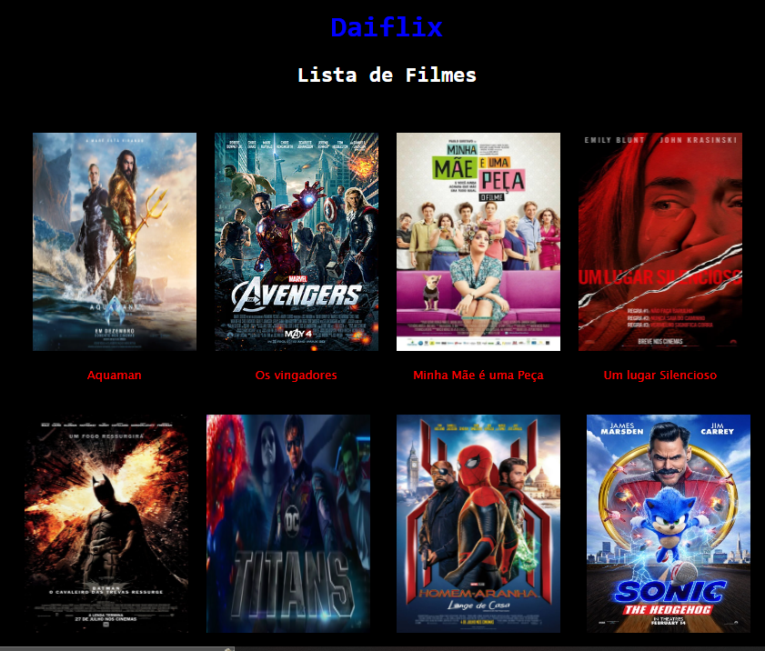

<h1 align="center">Lista de filmes</h1>
<

A lista filmes foi realizada com as linguagens:

 - javascript

 - HTML 
 

 - CSS

Onde cada imagem tem seus respectivos nome, com váriveis que poderá ser acrescentados novos itens, sem alterar todo o código 

